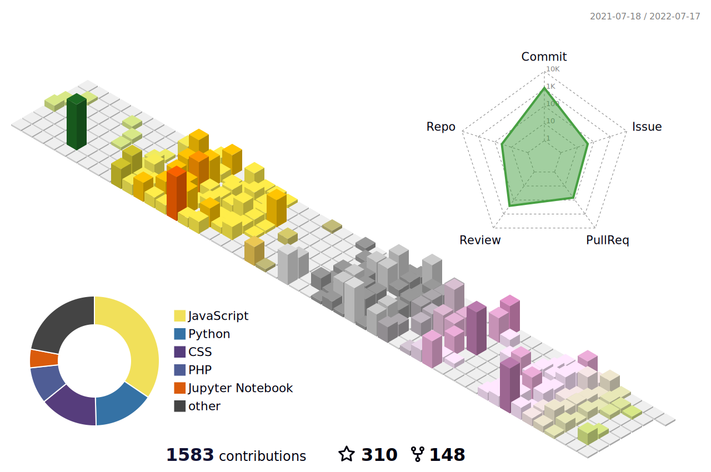

<h1 align="center"> :wave: Hi, I'm Vashishth</h1>

  
  <a href="https://www.linkedin.com/in/vashishth-patel-312a52204/">
    
  <a/>
  
  
  

---

- 🎓 Pre Final Year student at DDIT, Nadiad
- 👩‍💻 Backend Developer at Simulas
- ☀️ Technical Lead at Google Developer Student Clibs, DDU
- ☀️ Ex. Full Stack Web Developer at Acowale
- ☀️ Ex. Project Admin at GirlScript Summer Of Code
- ☀️ Ex. Mentor at GirlScript Winter Of Contributing
- ☀️ Ex. Replit Rep
- 🥇 Won more than 3 Hackathons
- 🛠  Proficient with APIs, Nodejs, Web Development and .NET Desktop Development
- 🌱 Currently learning more about Machine Learning and Blockchain
- 👯 Looking to collaborate on Blockchain projects
- 💬 Besides programming, I also love watching space and real story Movies.
- 🌐 Check out my website https://vasu-1.github.io/
- 📫 Shoot me a mail at `20ceubg080[AT]ddu[DOT]ac[DOT]in`

---

<table align="center">
  <tr>
    <td align="center">
      
    </td>
    <td align="center">
        
    </td>
  </tr>
</table>

---

  
 <b> 💻 Competencies </b>

 

  

 <b> :zap: Github 3D Activity </b>

  

 <b> :zap: Recent Activity </b>

  
<!--START_SECTION:activity-->
1. 🎉 Merged PR [#9](https://github.com/PRINCE-DHAMECHA/Gitty-Bot/pull/9) in [PRINCE-DHAMECHA/Gitty-Bot](https://github.com/PRINCE-DHAMECHA/Gitty-Bot)
2. 💪 Opened PR [#9](https://github.com/PRINCE-DHAMECHA/Gitty-Bot/pull/9) in [PRINCE-DHAMECHA/Gitty-Bot](https://github.com/PRINCE-DHAMECHA/Gitty-Bot)
3. 🎉 Merged PR [#8](https://github.com/PRINCE-DHAMECHA/Gitty-Bot/pull/8) in [PRINCE-DHAMECHA/Gitty-Bot](https://github.com/PRINCE-DHAMECHA/Gitty-Bot)
4. 💪 Opened PR [#8](https://github.com/PRINCE-DHAMECHA/Gitty-Bot/pull/8) in [PRINCE-DHAMECHA/Gitty-Bot](https://github.com/PRINCE-DHAMECHA/Gitty-Bot)
5. 🎉 Merged PR [#7](https://github.com/PRINCE-DHAMECHA/botflow/pull/7) in [PRINCE-DHAMECHA/botflow](https://github.com/PRINCE-DHAMECHA/botflow)
6. 💪 Opened PR [#7](https://github.com/PRINCE-DHAMECHA/botflow/pull/7) in [PRINCE-DHAMECHA/botflow](https://github.com/PRINCE-DHAMECHA/botflow)
<!--END_SECTION:activity-->

 <b> 🏆 GitHub Achievements </b>

<!-- 

 <b> 🌐 Website Performance </b>

 -->

---

  

[website]: https://vasu-1.github.io/
[facebook]: https://www.facebook.com/people/Vashishth-Patel/100071806075318/
[youtube]: https://www.youtube.com/channel/UCT_aAHVTwIPvW3mEUfHbB7g
[instagram]: https://www.instagram.com/vashishthchaudhary/
[linkedin]: https://www.linkedin.com/in/vashishth-patel-312a52204/
[askubuntu]: https://askubuntu.com/users/1357742/vashishth-patel
[codechef]: https://www.codechef.com/users/vashishth48
[hackerrank]: https://www.hackerrank.com/vashishthchaudh1
[github]: https://www.github.com/vasu-1
[qwicklabs]: https://www.cloudskillsboost.google/public_profiles/bf321214-af50-491e-a010-8fed8cb3d177
[devfolio]: https://devfolio.co/@vashisht
[leetcode]: https://leetcode.com/vashishthchaudhary48/
